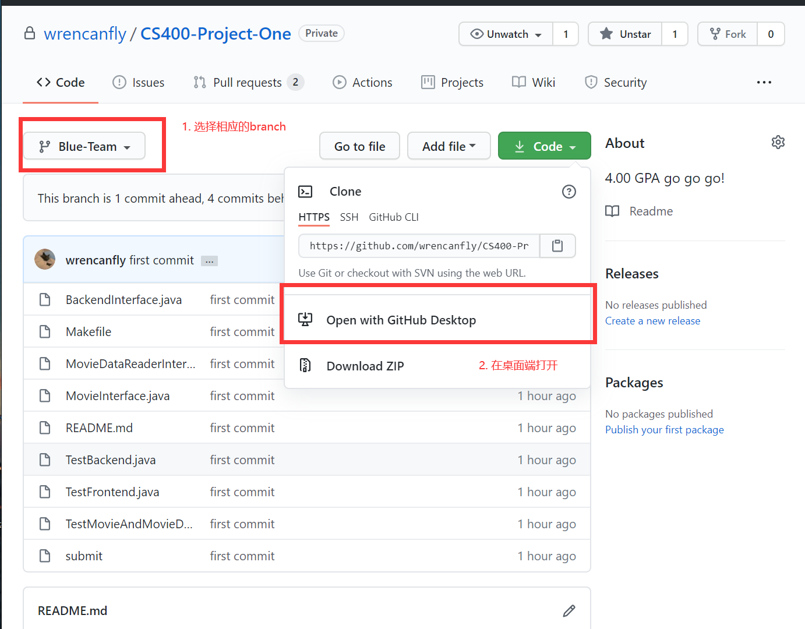
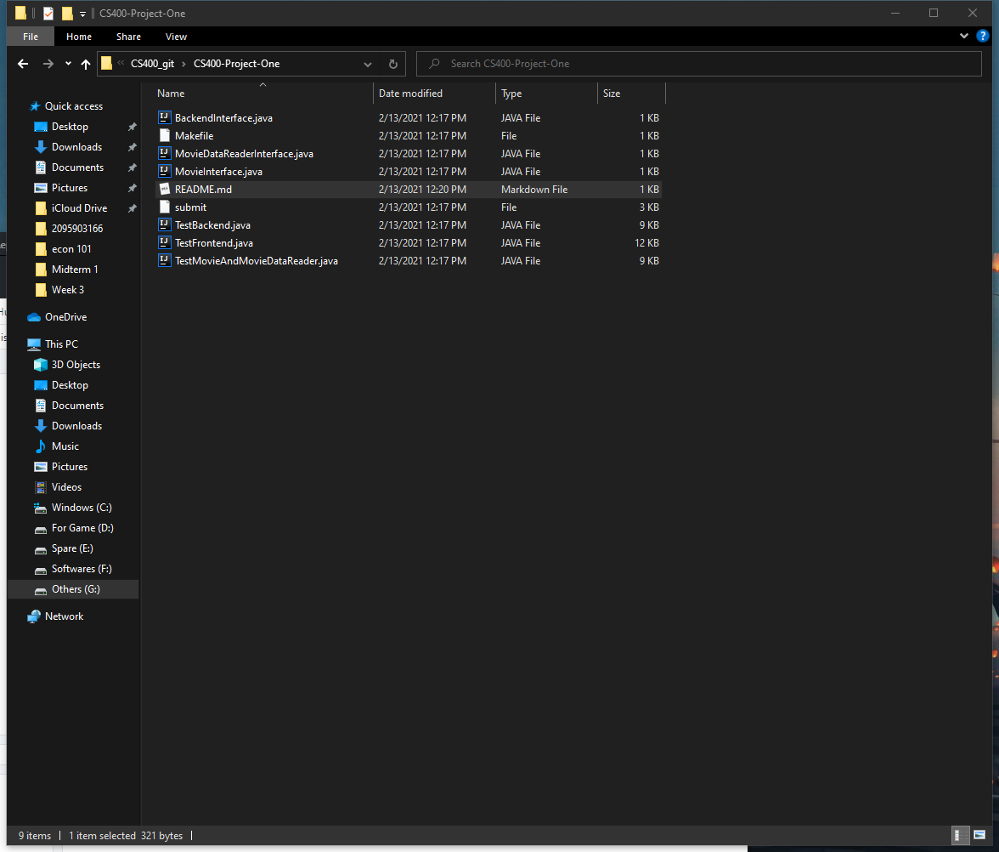

# CS400-Project-One
>Hi, this is the Welcome page of the first project. Wish u have a good day.
## Useful Links
- [Project One Proposal](https://docs.google.com/document/d/1D37vekXQF5yZ1XIk86QCM60h-NepSj-_KOx9oXUfwnQ/edit?ts=602335d4#heading=h.uqwr0iq8yt2d)


## Easiest way to access/edit code 🥳

1. Download [Github Desktop](https://desktop.github.com/)

2. Select correct branch and open with Github Desktop
3. Start coding 


## Quick note of git command 😴

```Bash
#Edit personal info
	git commit add git config --global user.email "you@example.com"
	git config --global user.name "Your name"

#Basic commands
	git add <filename>
	git commit -m "<commit information>"
	git status
	git log

#Change branch
	git checkout main	
	git checkout Red-Team
	git checkout Blue-Team
	
	git push --set-upstream origin main
	git push --set-upstream origin Red-Team
	git push --set-upstream origin Blue-Team
```
